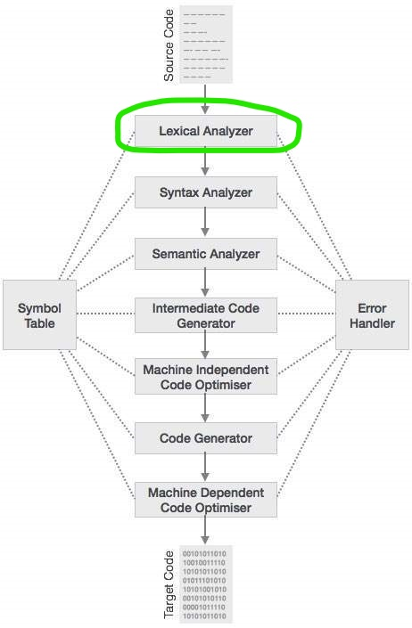

# CompilerDesign
A mini project for understanding the science of building Compiler; (Compiler Design) (VTU - BE - 6th Semester) (2015)
------

I built this project to understand the structure of a compiler. I have completed only the first (Lexical Analyzer) out of 7 phases of Compiler Design. Feel free to clone this project and complete it if you are interested.

## Lexical Analysis

-------
The first phase of compiler works as a text scanner. This phase scans the source code as a stream of characters and converts it into meaningful lexemes. Lexical analyzer represents these lexemes in the form of tokens as:
```
<token-name, attribute-value>
```

## Sample Input
Give any C program snippet as input
```
int a = b + c;
```
Output lexemes:
```
<KEYWORD,int>  <IDENTIFIER,a>  <OPERATOR,=>  <IDENTIFIER,b>  <OPERATOR,+>  <IDENTIFIER,c> 
```
## Screenshots

